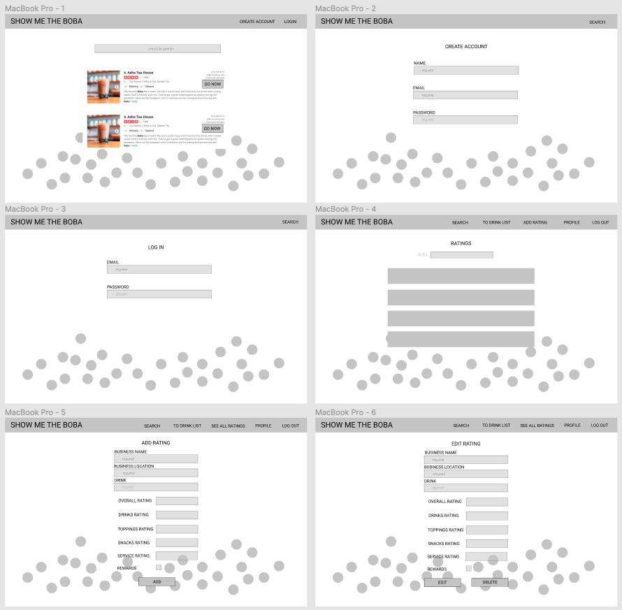
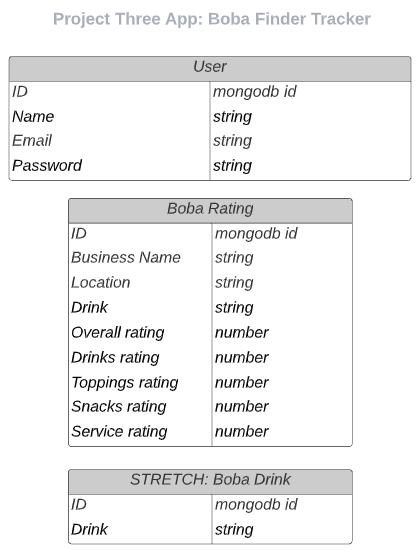

# SEI-629-Project-Three-App

## MERN Stack App: Boba Finder Tracker - SHOW ME THE BOBA

### Intro:
- For the boba connoisseur! An app to search for boba businesses to get that bubble tea fix. 
- Plus, rate and track boba businesses/drinks and see what other boba lovers are recommending.

### User Stories:

#### MVP
1. Allow a user (visitor) to use search (via Yelp API) on the app without having to sign up.
2. Allow a user to sign up, log in/log out of app (auth). 
3. As a user (registered), allow the following:
    * Read, create, edit ratings
    * Read, create, edit drink suggestions
    
- As a user (visitor), I want to search for boba businesses based on location so I can view an exclusive list of boba businesses in a specific area.
- As a user (registered), I want to create ratings for boba businesses I have visited and provide sub-ratings for other users to view regarding drinks, toppings, service, and snacks.

#### STRETCH 
- As a user (visitor), I would like a button included with the business info to get a map/directions to the business instantly.
- As a user (registered), I would like to view a profile page where I can edit my profile details.
- As a user (registered), I want to be able to view and access a "Drink Now" list, so I can see a feed of recommended drinks from other users.
    
### Getting Started:
- Planning: https://trello.com/b/uda0ga3z/boba-finder-tracker
- GitHub Front End: https://github.com/sgbondoc/boba-client
- GitHub Back End: https://github.com/sgbondoc/boba-api

### Future Features:
- Users (registered) are able to filter and/or sort by business, location, drink, or rating to view a specific list of boba businesses other users have rated.
- Users (registered) are able to upload a photo of their drink with their business rating or drink recommendation.
- Users (registered) are able to bookmark boba businesses.
- Users (registered) are able to like drink recomendations.
- Users (registered) are able to select background themes.

### Wireframes & Models:

### Technology:
- HTML, CSS, Javascript
- Mongoose/MongoDB/Atlas, Express, React, Node 
- Yelp Fusion API
- react-strap

### App Link: 
https://showmetheboba.herokuapp.com/
